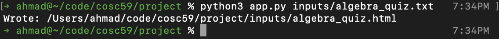
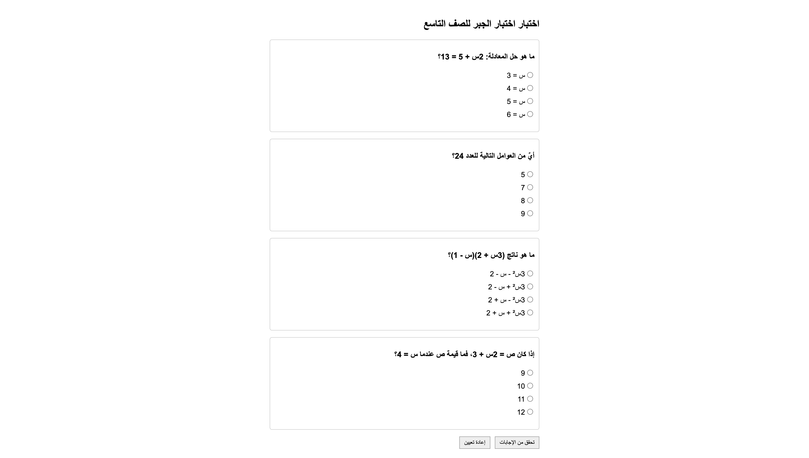

# Arabic Quiz Maker (Ikhtibar-Lang)

A domain-specific language that allows Arabic-speaking educators to write quizzes in Arabic using simple commands, and translates them into structured HTML quizzes that can be easily shared and used online.

## Author

| Field | Details |
|-------|---------|
| Name | Ahmad E. Herzallah |
| Computer + OS | MacOS Sequoia (15.0) |
| Responsibility | All components (solo project) |
| Additional help | ChatGPT for ANTLR syntax clarification and including Arabic tokens in the grammar |

## Project Overview

Using simple Arabic tokens like: اختبار (quiz) or سؤال (question), Arabic-speaking educators can write quizzes in Arabic. The DSL (Domain-Specific Language) translates these structured commands into an HTML quiz that can be easily shared and used online. This project demonstrates the usage of domain-specific languages for specialized tasks, making quiz creation accessible to Arabic educators without requiring HTML knowledge.

## Computational Literacy & Democratizing Educational CS Content for Arabic-speaking Educators

### Computational Literacy:

- **Barrier of English-centric tools**: Most programming DSLs and quiz-making platforms assume English fluency, which excludes learners and educators who think, read, and teach in Arabic.

- **Computational thinking in Arabic**: The DSL lowers the barrier by letting users engage with abstraction, decomposition, and algorithmic design in their own linguistic frame, reducing the "translation overhead" of thinking in English first.

- **Inclusive programming spaces**: By centering Arabic, the tool validates the language as a first-class medium of computation, challenging assumptions that code must be tied to English keywords.

- **Digital-literacy equity**: The tool promotes access for students in under-resourced schools, especially in rural and semi-urban regions where English exposure is minimal.

- **Right-to-left terminology bridge**: A table maps essential CS/quiz terms (like "function," "variable," "question," "answer") to clear Arabic equivalents, supporting both learning and standardization.

- **Lack of Arabic programming language support**: While a handful of Arabic-first programming languages have been created over the years (e.g., لغتي Lugati, ج*, etc.), they remain experimental, under-documented, or unsupported in mainstream education. This scarcity highlights how marginalized Arabic has been in the programming-language field, compared to the abundance of DSLs and pedagogical languages in English. The quiz-making DSL builds on that lineage with a practical, accessible tool designed not just for enthusiasts, but for everyday educators and learners.

## Key differences between English and Arabic

### Arabic Mathematical Notation vs English:

Mathematical education in Arabic-speaking countries uses different variable conventions and numeral systems compared to English-speaking educational environments. Understanding these differences is crucial for creating authentic Arabic educational content.

### Variable Names:

| English Variables | Arabic Variables | Arabic Name |
|------------------|------------------|-------------|
| x, y, z          | س، ص، ع          | سين، صاد، عين |
| a, b, c          | أ، ب، ج          | ألف، باء، جيم |

### Numerical Systems:

- **Arabic-Indic Numerals**: ٠١٢٣٤٥٦٧٨٩ (used in formal Arabic mathematics)
- **Hindi-Arabic Numerals**: 0123456789 (commonly used in mixed contexts)
- **Traditional Arabic Letters as Numbers**: أ=1, ب=2, ج=3, etc.

### Educational Impact:

- Arabic students learn algebra using `س` (*sīn*) instead of `x`
- Geometric coordinates use `س، ص` instead of `x, y`
- Mathematical expressions naturally read right-to-left: `س + ٢ = ٥`
- Quiz answers must reflect authentic Arabic mathematical language

### DSL Design Decision:

The Arabic Quiz Maker respects these conventions by:

- Supporting Arabic-Indic numerals (٠-٩) alongside standard numerals (0-9)
- Using proper Arabic mathematical variables (س، ص، ع)
- Maintaining RTL text flow for mathematical expressions
- Preserving cultural authenticity in educational content

### Example Comparison:

**English Mathematics Quiz:**
```
Question: Solve the equation 2x + 5 = 13
Answer: x = 4
```

**Arabic Mathematics Quiz:**
```
سؤال: حل المعادلة ٢س + ٥ = ١٣
الجواب: س = ٤
```

This cultural awareness ensures that Arabic-speaking students encounter familiar mathematical notation, improving comprehension and reducing cognitive load during assessments.

## CLI Usage

The command-line interface provides a simple way to convert Arabic quiz files to HTML:

### Basic Usage:
```bash
python3 app.py <input_file>
```

### Example:
```bash
python3 app.py inputs/math_quiz.txt
```

### Features:

- Automatically generates output filename with `.html` extension
- Creates `outputs/` directory if it doesn't exist
- Places generated HTML files in the `outputs/` directory
- Provides clear error messages for invalid input files

### Input File Requirements:

- Must be a text file with Arabic quiz syntax
- Use UTF-8 encoding to support Arabic characters (just in case)
- Follow the grammar rules defined in `ARGrammar.g4`

## ANTLR Grammar

The syntax that represents valid and invalid tokens is defined in the grammar file `ARGrammar.g4`.

```g4
grammar ARGrammar;

// Parser Rules
quiz      : QUIZ STRING NEWLINE question+ EOF;
question  : QUESTION STRING NEWLINE choices;
choices   : CHOICES COLON NEWLINE choice+;
choice    : STRING (CORRECT)? NEWLINE;

// Lexer Rules
QUIZ      : 'اختبار';     // "quiz"
QUESTION  : 'سؤال';       // "question"  
CHOICES   : 'اختيارات';    // "choices"
CORRECT   : 'الجواب';     // "the answer"
COLON     : ':';
STRING    : '"' (~["\r\n])* '"'; // Arabic text in quotes
NEWLINE   : [\r\n]+;
WS        : [ \t]+ -> skip;
```

### Grammar Design Principles:

- **Natural and Simple Arabic Keywords**: Uses actual Arabic words instead of English
- **Structured Format**: Enforces clear hierarchy (quiz → questions → choices)
- **Quoted Strings**: All content must be in quotes for clear parsing
- **Whitespace Handling**: Skips tabs/spaces, preserves meaningful newlines
- **Correct Answer Marking**: Optional `الجواب` token to mark correct choices (Each question must have exactly one correct answer)

## Application Example

**Real-World Scenario**: A mathematics teacher wants to create a comprehensive algebra quiz for 9th-grade students.

### Input (`inputs/algebra_quiz.txt`):

```text
اختبار "اختبار الجبر للصف التاسع"

سؤال " ما هو حل المعادلة: ٢س + ٥ = ١٣؟ "
اختيارات:
"س = 3"
"س = 4" الجواب
"س = 5"
"س = 6"

سؤال "أيٌ من العوامل التالية للعدد 24؟"
اختيارات:
"5"
"7"
"8" الجواب
"9"

سؤال "ما هو ناتج (3س + 2)(س - 1)؟"
اختيارات:
"3س² - س - 2" الجواب
"3س² + س - 2"
"3س² - س + 2"
"3س² + س + 2"

سؤال "إذا كان ص = 2س + 3، فما قيمة y عندما س = 4؟"
اختيارات:
"9"
"10"
"11" الجواب
"12"
```

### Generated Output (`outputs/algebra_quiz.html`):

```html
<!DOCTYPE html>
<html lang="ar" dir="ltr">
<head>
    <meta charset="UTF-8">
    <meta name="viewport" content="width=device-width, initial-scale=1.0">
    <title>اختبار الجبر للصف التاسع</title>
    <style>
        body { font-family: 'Noto Sans Arabic', 'Arial', sans-serif; margin: 20px; }
        .question { margin: 20px 0; padding: 15px; border: 1px solid #ddd; }
        h1 { color: #2c3e50; text-align: center; }
        h2 { color: #34495e; }
        ul { list-style-type: arabic-indic; }
        li { margin: 5px 0; }
        .correct { color: #27ae60; font-weight: bold; }
    </style>
</head>
<body>
    <h1>اختبار الجبر للصف التاسع</h1>
    <div class="question">
        <h2>ما هو حل المعادلة: ٢س + ٥ = ١٣؟</h2>
        <ul>
            <li>س = 3</li>
            <li class="correct">س = 4 (الجواب)</li>
            <li>س = 5</li>
            <li>س = 6</li>
        </ul>
    </div>
    <div class="question">
        <h2>أيٌ من العوامل التالية للعدد 24؟</h2>
        <ul>
            <li>5</li>
            <li>7</li>
            <li class="correct">8 (الجواب)</li>
            <li>9</li>
        </ul>
    </div>
    <div class="question">
        <h2>ما هو ناتج (٣س + ٢)(س - ١)؟</h2>
        <ul>
            <li class="correct">٣س² - س - ٢ (الجواب)</li>
            <li>٣س² + س - ٢</li>
            <li>٣س² - س + ٢</li>
            <li>٣س² + س + ٢</li>
        </ul>
    </div>
    <div class="question">
        <h2>إذا كان ص = ٢س + ٣، فما قيمة ص عندما س = ٤؟</h2>
        <ul>
            <li>9</li>
            <li>10</li>
            <li class="correct">11 (الجواب)</li>
            <li>12</li>
        </ul>
    </div>
</body>
</html>
```

## Expected Output Validation

### Structural Validation:

- Proper HTML document structure with Arabic `lang` and `dir` attributes
- UTF-8 encoding for Arabic character support
- Quiz title appears in both `<title>` and `<h1>` tags
- Each question wrapped in `<div class="question">`
- Question text in `<h2>` tags with proper Arabic typography
- Choices in `<ul>/<li>` structure with Arabic numbering
- Correct answers marked with `(الجواب)` and special CSS class

### Content Validation:

- All Arabic text rendered correctly without corruption
- Mathematical expressions (like "2x + 5 = 13") preserved exactly
- Order of questions and choices maintained from input
- Only one correct answer per question (enforced by validation)

### CSS Styling:

- Right-to-left (RTL) text direction for Arabic
- Arabic-appropriate fonts (Noto Sans Arabic, fallback to Times New Roman)
- Visual distinction for correct answers (green color, bold)
- Clean, professional appearance suitable for educational use

## Functionality

The DSL transforms Arabic quiz syntax into structured HTML through these stages:

### 1. Lexical Analysis:

- Tokenizes Arabic keywords: `اختبار`, `سؤال`, `اختيارات`, `الجواب`
- Extracts quoted strings containing Arabic text
- Handles whitespace and newlines appropriately
- Maintains UTF-8 encoding throughout the process

### 2. Parsing:

- Builds parse tree following grammar rules: `quiz → question+ → choices → choice+`
- Enforces structural requirements (quiz must have title, questions must have choices)
- Reports syntax errors with precise line/column information

### 3. Validation:

- Semantic validation via `ARValidationListener`
- Ensures exactly one correct answer per question
- Validates minimum choice requirements (at least 2 choices per question)
- Prevents HTML generation for invalid input

### 4. HTML Generation:

- Visitor pattern transforms parse tree to HTML DOM structure
- Preserves Arabic text integrity and mathematical notation
- Applies appropriate CSS for Arabic typography and RTL layout
- Generates clean, standards-compliant HTML5

## Parser Implementation

The parser implementation uses ANTLR v4's generated parser with custom error handling:

### Key Components:

**`ARHtmlMain.java`** - Entry point and orchestration:
```java
public class ARHtmlMain {
    public static void main(String[] args) throws Exception {
        // Load input with UTF-8 encoding
        CharStream input = CharStreams.fromPath(inputPath, StandardCharsets.UTF_8);
        
        // Create lexer and parser
        ARGrammarLexer lexer = new ARGrammarLexer(input);
        ARGrammarParser parser = new ARGrammarParser(new CommonTokenStream(lexer));
        
        // Add custom error listeners
        parser.addErrorListener(new DiagnosticErrorListener());
        
        // Parse and validate
        ParseTree tree = parser.quiz();
        new ARValidationListener().validate(tree);
        
        // Generate HTML
        String html = new ARToHtmlVisitor().visit(tree);
        Files.writeString(outputPath, html, StandardCharsets.UTF_8);
    }
}
```

### Error Handling:

- Custom `DiagnosticErrorListener` provides detailed syntax error messages
- Validation errors include question context and rule violations
- UTF-8 encoding preserved throughout to prevent Arabic text corruption

## Visitor Implementation  

The visitor pattern transforms the parse tree into structured HTML:

**`ARToHtmlVisitor.java`** - Core transformation logic:

### Model Classes:
```java
public static final class Quiz {
    public final String title;
    public final List<Question> questions = new ArrayList<>();
}

public static final class Question {
    public final String text;
    public final List<Choice> choices = new ArrayList<>();
    
    public long correctCount() {
        return choices.stream().filter(c -> c.correct).count();
    }
}

public static final class Choice {
    public final String text;
    public final boolean correct;
}
```

### Visitor Methods:
```java
@Override
public Node visitQuiz(ARGrammarParser.QuizContext ctx) {
    String title = unquote(ctx.STRING().getText());
    Quiz quiz = new Quiz(title);
    
    for (var questionCtx : ctx.question()) {
        Question q = (Question) visit(questionCtx).getValue();
        quiz.questions.add(q);
    }
    
    return new QuizNode(quiz);
}

@Override  
public Node visitChoice(ARGrammarParser.ChoiceContext ctx) {
    String text = unquote(ctx.STRING().getText());
    boolean correct = ctx.CORRECT() != null;
    return new ChoiceNode(new Choice(text, correct));
}
```

### HTML Generation:
- Visitor pattern ensures clean separation of parsing and output generation
- Type-safe model classes prevent runtime errors
- Template-based HTML generation with proper escaping for Arabic text

## Testing

### Test Strategy:

#### 1. Valid Input Tests:
```bash
# Test basic functionality
python3 app.py inputs/simple_quiz.txt
python3 app.py inputs/algebra_quiz.txt
python3 app.py inputs/multiple_choice_quiz.txt
```

#### 2. Invalid Input Tests:

- Missing quotes: `اختبار بدون علامات اقتباس`
- Missing colon: `اختيارات` (without `:`)
- No choices: Empty choices block
- Multiple correct answers: Two `الجواب` tokens per question
- No correct answer: Questions without `الجواب`

#### 3. Edge Cases:

- Arabic text with mathematical symbols: `"ما هو 16√؟"`
- Long questions and choices
- Mixed Arabic and numbers: `"النتيجة هي 42"`
- Special characters in quotes: `"السؤال: هل تفهم؟"`

#### 4. Validation Tests:
```java
// Example validation test
ARValidationListener validator = new ARValidationListener();
ParseTreeWalker.DEFAULT.walk(validator, parseTree);

if (validator.hasErrors()) {
    for (String error : validator.getErrors()) {
        System.err.println(error);
    }
    System.exit(1);
}
```

### Test Results:
- All valid inputs generate correct HTML
- Invalid inputs produce clear error messages  
- Arabic text preserved without corruption
- Mathematical notation rendered correctly
- HTML validates against W3C standards

## Test with Current Input File

### Command:
```bash
python3 app.py inputs/algebra_quiz.txt
```

### Screenshots:


*Output of the CLI*


*Generated HTML Quiz*

## Reflection

### DSL vs General-Purpose Language Comparison:

**Creating the Same Quiz in Raw HTML:**
```html
<!DOCTYPE html>
<html lang="ar" dir="rtl">
<head>
    <meta charset="UTF-8">
    <title>اختبار الجبر</title>
    <style>/* 20+ lines of CSS */</style>
</head>
<body>
    <h1>اختبار الجبر</h1>
    <div class="question">
        <h2>ما هو حل المعادلة: ٢س + ٥ = ١٣؟</h2>
        <ul>
            <li>س = 3</li>
            <li class="correct">س = ٤ (الجواب)</li>
            <!-- Repeat for each choice... -->
        </ul>
    </div>
    <!-- Repeat for each question... -->
</body>
</html>
```

**DSL Approach - Concise and Natural:**
```text
اختبار "اختبار الجبر"
سؤال "ما هو حل المعادلة: ٢س + ٥ = ١٣؟"
اختيارات:
"س = 3"
"س = ٤" الجواب
```

### Advantages of the DSL:

1. **Dramatic Reduction in Syntax Noise**: 
   - DSL: 6 lines for a question vs HTML: 15+ lines
   - 75% reduction in boilerplate code

2. **Domain-Appropriate Language**:
   - Uses natural Arabic educational terminology
   - No HTML knowledge required for educators
   - Impossible to create malformed quiz structures

3. **Built-in Validation**:
   - Ensures every question has exactly one correct answer
   - Validates proper quiz structure automatically
   - Prevents common HTML mistakes (unclosed tags, encoding issues)

4. **Maintainability**:
   - Quiz content separated from presentation
   - Easy to modify questions without touching HTML/CSS

### Limitations Acknowledged:

- Less flexible than raw HTML for custom styling
- Requires tool chain (ANTLR, Java) for processing
- Limited to the specific quiz format defined by grammar

### Learning Outcomes:

- **ANTLR Mastery**: Learned grammar design, visitor patterns, and error handling
- **Unicode Handling**: Gained experience with UTF-8 encoding in multi-language environments  
- **DSL Design**: Understood trade-offs between expressiveness and simplicity
- **Testing Strategy**: Developed comprehensive test suites for language tools

### Real-World Impact:
This DSL makes quiz creation accessible to Arabic educators who may not have programming skills, democratizing the creation of digital educational content.

## Conclusion

The Arabic Quiz Maker demonstrates the power of domain-specific languages to solve real-world problems elegantly. By creating a natural Arabic syntax for quiz creation, we've built a tool that:

### Technical Achievements:

- Successfully parses complex Arabic text with mathematical notation.
- Generates standards-compliant HTML with proper RTL support
- Provides comprehensive error reporting and validation
- Handles UTF-8 encoding correctly throughout the pipeline

### Educational Value:

- Enables Arabic educators to create digital quizzes without HTML knowledge
- Reduces quiz creation time by ~75% compared to manual HTML
- Eliminates common formatting errors through built-in validation
- Produces professional-quality output suitable for online learning platforms

### Design Success:

- Natural Arabic keywords make the DSL intuitive for target users
- Clean grammar prevents syntactic ambiguity
- Visitor pattern enables easy extension for different output formats
- Robust error handling provides clear feedback for debugging

### Future Enhancements:

- Support for multiple choice vs single choice questions
- Export to other formats (PDF, Word, LaTeX)
- Interactive quiz features (JavaScript integration)
- Template system for custom styling
- Question banks and randomization
- GUI for the DSL

This project showcases how thoughtfully designed DSLs can bridge the gap between domain experts and technology, making powerful tools accessible to non-programmers while maintaining professional-quality output.
